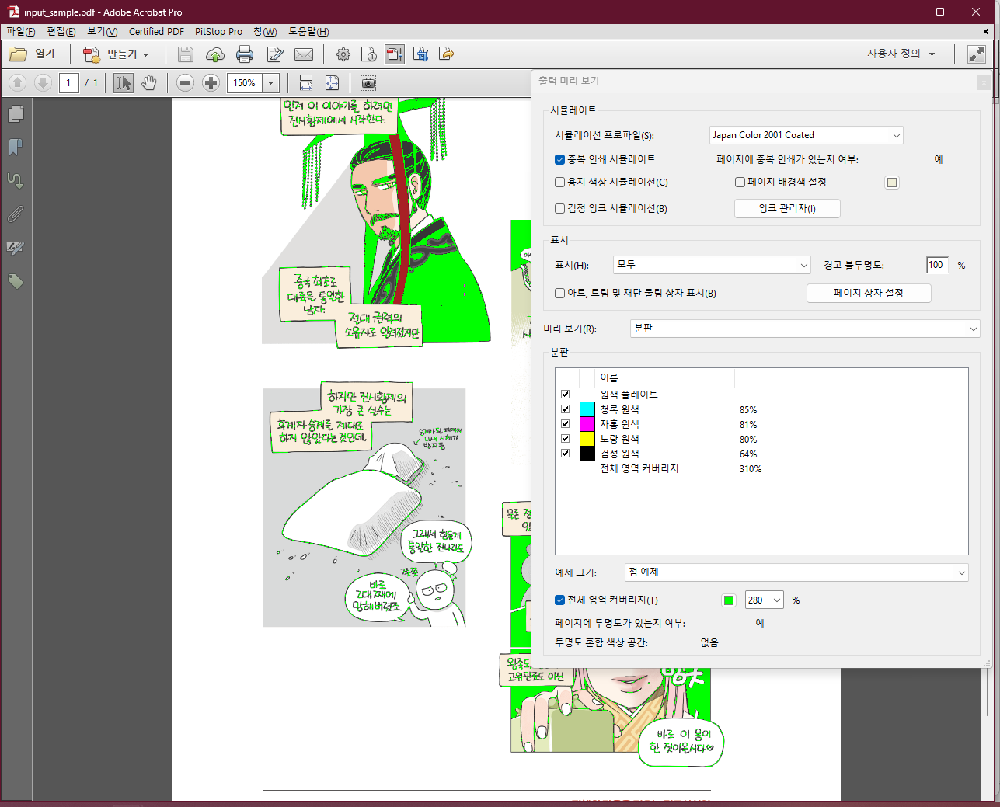
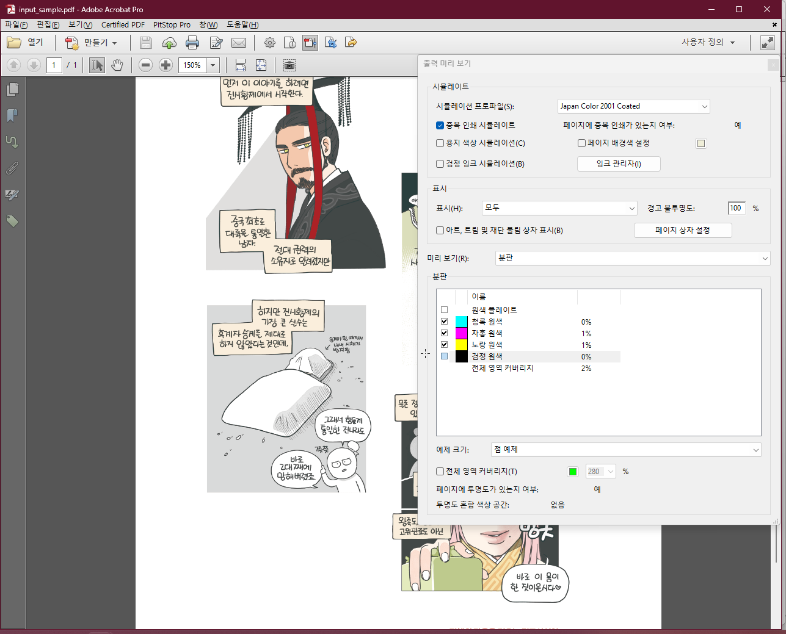
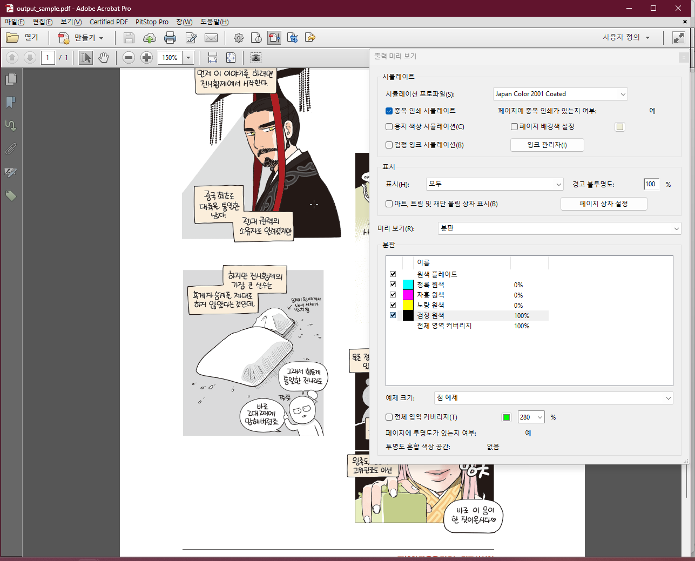
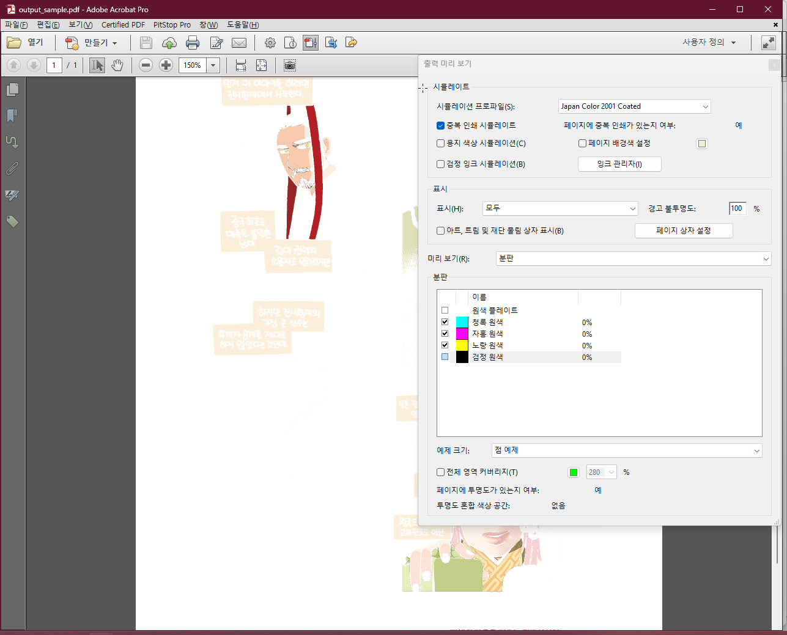

# Rich Black to K

PDF 안의 **비트맵 이미지**를 검사해 검정/회색에 가까운 픽셀을 **K-only**(먹 1도)로 바꾸는 도구다.

컬러 그림과 검정/회색 글씨가 하나의 비트맵에 함께 들어 있는 PDF를 염두에 두고 만들었다. 컬러 부분은 가능한 한 유지하면서, 검정/회색 글씨와 그 주변의 안티에일리어싱 픽셀을 K판으로 정리해 4도 인쇄에서 핀 어긋남으로 생길 수 있는 색 테두리를 줄이는 것이 목적이다.

**중요:** 실제 변환 전에 `--dry-run`으로 처리 대상을 확인하는 것을 권장한다.


## 처리 예시

1. 비트맵 이미지 중 텍스트 등에 리치블랙이 섞여 있음(원래는 RGB 이미지) -> 인쇄 시 텍스트 핀 맞추기 어려움




2. 프로그램 실행 후 리치블랙을 모두 먹으로 변환





## 처리 방식

### RGB 이미지

프로파일이 없는 `DeviceRGB` 이미지는 **sRGB**로 간주한다.

1. RGB → Lab 변환
2. 중성색/어두운 픽셀 판별
3. 컬러 픽셀은 선택된 CMYK ICC 프로파일로 정상 RGB → CMYK 변환
4. 중성 픽셀은 원래 밝기(`L\*`)와 가장 가까운 K-only 값으로 치환

즉, RGB 이미지는 처리 후 전체가 CMYK가 된다.

```text
컬러 픽셀
RGB → 선택된 ICC 기준 CMYK

중성 픽셀
RGB → Lab → 원래 L*와 가장 가까운 C0 M0 Y0 K?
```

중성 픽셀의 K값을 무조건 K100으로 만드는 것이 아니라, 원래 `L\*`와 가장 가까운 K값을 사용하므로 밝은 회색/안티에일리어싱의 농도를 가능한 한 유지한다.

### 기존 CMYK 이미지

기존 CMYK 이미지는 **조건에 해당하지 않는 컬러 픽셀의 CMYK 값을 그대로 유지**한다.

선택된 CMYK ICC 프로파일은 다음을 판단하는 데 사용한다.

- 현재 픽셀이 검정/회색에 가까운 중성색인지
- 해당 픽셀의 `L\*`가 얼마인지
- 같은 밝기에 가장 가까운 K-only 값이 얼마인지

중성/K-only 대상 픽셀만 `C0 M0 Y0 K?`로 바뀐다. 한 이미지 안에 K-only 변환 대상 픽셀이 하나도 없으면 해당 CMYK 이미지 자체를 다시 쓰지 않는다.

### 안티에일리어싱 가장자리 보정

글자 가장자리의 안티에일리어싱 픽셀은 본래 검정/회색 계열이어도 C/M/Y가 조금 섞여 있어 일반 중성색 조건에서 빠질 수 있다.

이를 보완하기 위해 다음과 같이 **2단계 판정**을 사용한다.

1. 일반 판정으로 확실한 중성 픽셀을 찾는다.
2. 그 픽셀의 **주변 1px**에 한해서 chroma 조건을 조금 완화해 다시 검사한다.

기본값에서는 다음과 같다.

```text
일반 판정
C*ab <= 6
L*   <= 95

1px 가장자리 판정
C*ab <= 6 × 1.7 = 10.2
L*   <= 95
```

가장자리 판정은 이미지 전체에 적용하지 않고, **이미 일반 중성 픽셀로 판정된 영역의 바로 주변에만** 적용한다.

`--edge-chroma-multiplier`로 가장자리에서 chroma를 얼마나 더 허용할지 조절할 수 있다.

### 투명성

`/SMask` 등 기존 이미지의 soft mask 참조는 유지한다. 색상 스트림만 수정하므로 기존 투명성 정보는 보존된다.

### 재사용 이미지에 대한 안전장치

PDF 내부에서는 하나의 이미지가 여러 페이지에서 같은 `xref`로 재사용될 수 있다.

하나의 이미지가 제외 페이지와 처리 대상 페이지 양쪽에 동시에 사용되고 있다면, 제외 페이지까지 함께 바뀌는 것을 막기 위해 **그 이미지 전체를 건너뛴다.**

이 경우 다음과 비슷한 메시지가 출력된다.

```text
[SKIP] xref ...: 제외/처리 페이지에 동시에 재사용됨 ...
```


## ICC 프로파일 선택

`--icc`는 필수 옵션이 아니다.

CMYK 출력 프로파일은 다음 우선순위로 선택한다.

1. 사용자가 `--icc`로 직접 지정한 ICC
2. PDF 안의 **Output Intent ICC**
3. 스크립트 위치 기준 `profiles/JapanColor2001Coated.icc`

출판 실무에서는 대개 이 프로파일을 사용하므로 `--icc`를 지정하지 않아도 된다.

```powershell
python richblack_to_k.py input.pdf output.pdf
```

PDF에 Output Intent가 있더라도 Pillow/LittleCMS에서 CMYK 출력 프로파일로 사용할 수 없는 ICC라면 경고를 표시하고 `profiles/JapanColor2001Coated.icc`로 대체한다.

다른 인쇄 조건의 ICC를 강제로 사용하려면 `--icc`를 지정한다.

```powershell
python richblack_to_k.py input.pdf output.pdf --icc other.icc
```


## 판정 기본값

기본값은 다음과 같다.

```text
--chroma 6
--max-l 95
--edge-chroma-multiplier 1.7
```

- `C*ab`가 작을수록 무채색에 가깝다.
- `L*`는 밝기다. 0은 검정, 100은 흰색이다.
- `--edge-chroma-multiplier`는 일반 조건으로 잡힌 픽셀 주변 1px에서만 적용한다.

기본값을 쓰지 않고 더 세밀하게 조정할 수 있다. 예를 들어 다음과 같이 쓰면

```powershell
--chroma 4
```

중성색 판정을 더 엄격하게 한다.

```powershell
--max-l 90
```

이건 밝은 픽셀을 덜 잡는다.

```powershell
--max-l 99
```

더 밝은 안티에일리어싱까지 잡는다.

```powershell
--edge-chroma-multiplier 1.3
```

가장자리 chroma 완화를 더 보수적으로 한다.

```powershell
--edge-chroma-multiplier 1
```

가장자리 1px 검사는 유지하지만 chroma 기준은 일반 판정과 같아져 추가 완화가 사실상 없어지는 셈이다.


## 저장소 구성

- `richblack_to_k.py`: 변환 프로그램
- `input_sample.pdf`: 테스트용 입력 PDF
- `output_sample.pdf`: 변환 결과 예시
- `assets`: 본 리드미에 들어간 스샷 폴더
- `profiles/JapanColor2001Coated.icc`: 기본 CMYK ICC 프로파일

기본 ICC 파일은 **현재 작업 폴더가 아니라 `richblack_to_k.py`가 있는 위치를 기준으로** 찾는다.


## 사용 방법

아래 설명은 **Windows 기준**이다.

### 1. 본 저장소 파일 다운로드

탐색기에서 본 저장소의 파일들을 다운로드할 폴더의 상위 폴더로 이동해 명령 프롬프트(`cmd`)나 파워셸 등을 열고 다음 명령을 입력한다.

```powershell
git clone https://github.com/anemochore/richblack-to-k
```


### 2. 파이썬 및 패키지 설치

이 프로그램은 **파이썬 3.10 이상**을 권장한다.

설치된 파이썬 버전을 확인하려면 다음 명령을 실행한다.

```powershell
python --version
```

예를 들어 다음처럼 나오면 파이썬이 설치되어 있는 것이다.

```text
Python 3.13.7
```

`python` 명령을 찾을 수 없다고 나오면 파이썬을 먼저 설치한다(설치할 때는 가능하면 **Add Python to PATH** 옵션을 켠다).

그다음 필요한 패키지를 다음과 같이 설치한다.

처음 한 번만 실행하면 된다.

```powershell
python -m pip install -U pymupdf numpy pillow
```

각 패키지 설명은 다음과 같다.

- **PyMuPDF**: PDF 읽기/수정
- **NumPy**: 이미지 픽셀 처리
- **Pillow**: ICC 색상 변환


### 3. 샘플 PDF로 먼저 검사해 보기

실제 PDF를 수정하기 전에 `--dry-run`으로 어떤 이미지와 픽셀이 처리 대상인지 확인한다.

```powershell
python richblack_to_k.py input_sample.pdf --dry-run
```

`--dry-run`에서는 PDF를 수정하거나 새 파일을 만들지 않으며, **이미지별 상세 정보도 자동으로 출력**한다(별도의 verbose 옵션은 없다).

실행 시작 부분에는 현재 적용되는 조건이 표시된다.

```text
출력 CMYK ICC: ...
중성 조건: C*ab <= 6
밝기 조건: L* <= 95
가장자리 조건: 1px 이내, C*ab <= 10.2 (--chroma x 1.7), L* <= 95
```

마지막에는 대략 다음과 같은 통계가 나온다.

```text
=== 결과 ===
검사 결과
  RGB 이미지: ...
  기존 CMYK 이미지: ...
  지원하지 않는 색공간: ...
  8 bpc가 아니어서 건너뜀: ...
  제외 페이지 전용 이미지: ...
  제외/처리 페이지에 공유되어 건너뜀: ...
  오류: 0개
  검사한 픽셀: ...
  K-only 변환 예정 픽셀: ...
PDF는 수정하지 않았습니다.
```

**어떤 파일이든 `오류: 0개`인지 검사를 한 뒤 실제 변환을 실행하자.**


### 5. 샘플 PDF 실제 변환해 보기

```powershell
python richblack_to_k.py input_sample.pdf output_test.pdf
```

완료되면 같은 폴더에 `output_test.pdf`가 생긴다.

저장소에 포함된 `output_sample.pdf`와 비교해 결과를 확인할 수 있다(기본값으로 만든 파일이다).


### 6. 실제 PDF 변환하기

예를 들어 입력 파일이 `book.pdf`이라면 먼저 해당 파일을 프로그램이 있는 폴더로 옮긴다.

출력 파일을 `book_konly.pdf`로 만들려면 다음과 같이 실행한다.

```powershell
python richblack_to_k.py book.pdf book_konly.pdf
```

원본 PDF와 출력 PDF의 파일명을 같게 지정할 수는 없다.

프로그램은 **이미지 처리를 시작하기 전에 출력 경로를 먼저 검사**한다. 파일이 다른 프로그램에서 열려 있거나 잠겨 있으면 오류 메시지를 내고 즉시 종료한다.

처리 도중 다른 프로그램이 출력 파일을 새로 열 수도 있으므로 **실제 저장 직전에도 한 번 더 확인**한다.


## 옵션

### `--icc`

사용할 CMYK ICC 프로파일을 직접 지정한다.

```powershell
--icc profiles\JapanColor2001Coated.icc
```

미지정 시 PDF Output Intent → 기본 `profiles/JapanColor2001Coated.icc` 순서로 선택한다.


### `--dry-run`

실제 처리는 수행하지 않고 분석만 한다.

이미지별 상세 정보도 자동으로 출력된다.


### `--chroma`

일반 중성색으로 인정할 최대 `C*ab`를 지정한다.

기본값:

```text
6
```

값을 낮추면 검정/회색 판정이 더 엄격해진다.

```powershell
--chroma 4
```

가장자리 판정의 chroma 기준도 이 값에 비례해 함께 변한다.


### `--max-l`

K-only로 바꿀 픽셀의 최대 `L\*`를 지정한다.

기본값:

```text
95
```

값을 높일수록 더 밝은 회색/안티에일리어싱까지 처리한다.

```powershell
--max-l 99
```

가장자리 1px 판정에서도 같은 `L\*` 기준을 사용한다.


### `--edge-chroma-multiplier`

일반 중성 픽셀 주변 **1px**에서 `--chroma`에 곱할 배수를 지정한다.

기본값:

```text
1.7
```

예를 들어 다음과 같다면:

```text
--chroma 6
--edge-chroma-multiplier 1.7
```

가장자리의 chroma 기준은 `6 × 1.7 = 10.2`가 된다.

더 보수적으로 하려면 값을 낮춘다.

```powershell
--edge-chroma-multiplier 1.3
```

최솟값은 `1`이다.


### `--exclude-pages`

처리에서 제외할 **물리 페이지**를 지정한다. 범위와 개별 페이지를 함께 지정할 수 있다.

```powershell
python richblack_to_k.py book.pdf book_konly.pdf --exclude-pages "1,9,57,105-107"
```

위 예시는 다음 페이지를 제외한다.

```text
1, 9, 57, 105, 106, 107
```


## 결과 메시지 읽는 법

실제 변환이 끝나면 결과가 `검사 결과`와 `적용 결과`로 나뉘어 표시된다.

예:

```text
=== 결과 ===
검사 결과
  RGB 이미지: 4개
  기존 CMYK 이미지: 0개
  지원하지 않는 색공간: 0개
  8 bpc가 아니어서 건너뜀: 0개
  제외 페이지 전용 이미지: 0개
  제외/처리 페이지에 공유되어 건너뜀: 0개
  오류: 0개
  검사한 픽셀: 2,457,944

적용 결과
  RGB→CMYK 변환 완료: 4개
    └ 그중 K-only 적용: 4개
  기존 CMYK에 K-only 적용: 0개
  K-only 변환 완료 픽셀: 945,496
출력: output_sample.pdf
```

의미는 다음과 같다.

- **RGB→CMYK 변환 완료**: RGB 이미지 전체가 선택된 ICC 기준 CMYK로 변환된 이미지 수
- **그중 K-only 적용**: RGB→CMYK 변환 과정에서 중성/K-only 픽셀이 실제로 하나 이상 있었던 이미지 수
- **기존 CMYK에 K-only 적용**: 원래 CMYK였고 실제로 K-only 대상 픽셀이 있어 수정된 이미지 수
- **K-only 변환 완료 픽셀**: RGB 이미지와 기존 CMYK 이미지를 합쳐 실제로 K-only로 바뀐 픽셀 수

즉 RGB 이미지가 CMYK로 변환되었다고 해서 이미지 전체가 K-only가 된다는 뜻은 아니다. 컬러 픽셀은 정상 CMYK로 변환되고, 조건에 해당하는 중성 픽셀만 K-only가 된다.


## 권장 작업 순서

1. 원본 PDF를 백업한다.
2. 탐색기에서 프로그램 폴더 위치에 CMD/파워셸을 연다.
3. `--dry-run`으로 먼저 분석한다.
4. RGB/CMYK 이미지 수와 오류 여부, K-only 예정 픽셀 수를 확인한다.
5. 실제 변환을 실행한다.
6. 애크러뱃의 '출력 미리보기'에서 C/M/Y/K 판을 확인한다.
7. 특히 검정 글씨와 안티에일리어싱 가장자리에 C/M/Y가 남아 있는지, 반대로 주변 컬러가 과도하게 K-only로 바뀌지는 않았는지 확인한다.
8. 최적의 결과를 찾기 위해 `--exclude-pages`, `--chroma`, `--max-l`, `--edge-chroma-multiplier`를 조정한다.


## 주의사항

### RGB 이미지는 CMYK로 변환된다

처리 대상 RGB 이미지는 중성 픽셀이 하나도 없더라도 **전체 이미지가 선택된 ICC 기준 CMYK로 변환**된다.

컬러 픽셀은 K-only가 되는 것이 아니라 정상적인 RGB → CMYK 색상 변환을 거친다.

### 기존 CMYK 이미지의 컬러 픽셀은 유지된다

기존 CMYK 이미지에서는 중성/K-only 대상 픽셀만 바뀐다. 조건에 해당하지 않는 컬러 픽셀의 CMYK 값은 그대로 유지한다.

### DeviceRGB는 sRGB로 간주할 수 있다

RGB 이미지 자체에 embedded RGB ICC가 있으면 그 프로파일을 사용한다. 프로파일이 없는 `DeviceRGB` 이미지는 sRGB로 간주한다.

### CMYK 해석은 선택된 출력 ICC를 기준으로 한다

기존 CMYK 이미지의 중성 여부와 `L\*` 계산도 선택된 CMYK ICC를 기준으로 판단한다. 원래 CMYK 이미지가 실제로 다른 인쇄 조건을 전제로 만들어졌다면 색도 해석에 차이가 있을 수 있다.

### 이미지 압축 방식이 달라질 수 있다

수정된 이미지 스트림은 PDF 안에서 다시 압축된다. 따라서 변환 후 PDF 파일 크기가 원본과 달라질 수 있다.

### 벡터 오브젝트나 텍스트는 처리하지 않는다

이 프로그램의 대상은 PDF 안의 **비트맵 이미지**다.

PDF 텍스트, 벡터 선, 벡터 도형 등의 색상은 변경하지 않는다. 그런 작업은 더 쉽게 PitStop으로 하면 된다.

### 8 bpc 이미지만 처리한다

현재 버전은 8 bits/component 이미지 처리를 전제로 한다. 다른 bpc 이미지는 건너뛴다.

### inline image는 현재 처리하지 않는다

PDF 내부에서 별도의 `xref`를 갖지 않는 inline image는 현재 자동 변환 대상에서 제외된다.

### 출력 파일 잠금 검사는 완전한 예약 기능은 아니다

프로그램은 처리 전과 저장 직전에 출력 파일 상태를 확인하지만, 그 사이에 다른 프로그램이 파일을 여는 것 자체를 시스템 차원에서 금지하는 것은 아니다.


## 라이선스

`profiles/JapanColor2001Coated.icc`는 이 저장소의 라이선스 대상이 아니며, 해당 ICC 프로파일의 원래 라이선스 조건이 별도로 적용된다.

샘플 PDF는... 으으으 샘플인데 그냥 좀 넘어가자.


## 빠른 명령 모음

### 패키지 설치(최초 한 번만)

```powershell
python -m pip install -U pymupdf numpy pillow
```

### 샘플 dry-run

```powershell
python richblack_to_k.py input_sample.pdf --dry-run
```

### 실제 파일 변환

```powershell
python richblack_to_k.py input.pdf output.pdf
```

### 다른 ICC 직접 지정

```powershell
python richblack_to_k.py input.pdf output.pdf --icc other.icc
```

### 일부 물리 페이지 제외

```powershell
python richblack_to_k.py input.pdf output.pdf --exclude-pages "1,9,57,105-107"
```

### 중성색 판정을 더 엄격하게

```powershell
python richblack_to_k.py input.pdf output.pdf --chroma 4
```

### 더 밝은 안티에일리어싱까지 처리

```powershell
python richblack_to_k.py input.pdf output.pdf --max-l 99
```

### 가장자리 판정을 더 보수적으로(덜 공격적으로)

```powershell
python richblack_to_k.py input.pdf output.pdf --edge-chroma-multiplier 1.3
```


## todo
- 클라이언트 JS로 포팅하기(기술적으로는 가능)